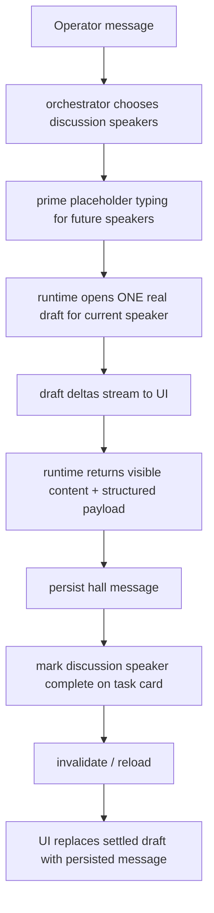
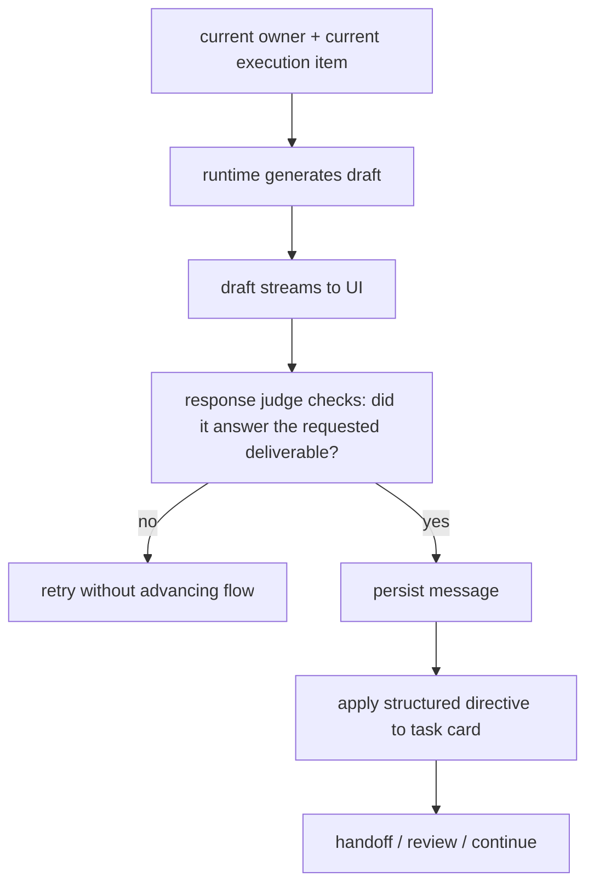

# Hall Reply Lifecycle

This document defines the single source of truth for hall replies, typing, handoff, and task state.

If a future change violates this document, it is very likely to reintroduce one of the regressions we already saw:

- a reply appears and then disappears
- typing lingers after a reply lands
- visible `@someone` changes execution routing
- a completed handoff gets overridden by hidden blocked state
- left list / right detail / bottom console disagree about the current task state

## Goal

Hall must satisfy all three:

- execution is reliable
- agents follow the user's latest instruction
- replies feel natural without breaking task flow

That only works if we keep a hard separation between:

- system-controlled flow state
- agent-generated content
- UI-only transient typing state

## Single Source Of Truth

Only these layers are allowed to own these pieces of state.

| State | Owner | Notes |
| --- | --- | --- |
| `stage`, `status` | task card | Never derive from visible text. |
| `currentOwnerParticipantId` | task card | Never derive from visible `@mention`. |
| `currentExecutionItem` | task card | The only authority for the current step. |
| `plannedExecutionOrder`, `plannedExecutionItems` | task card | The only authority for planned routing. |
| `discussionCycle.expectedParticipantIds` | task card | Authoritative expected discussion speakers. |
| `discussionCycle.completedParticipantIds` | task card | Authoritative completed discussion speakers. |
| persisted thread history | hall messages store | Authoritative visible history. |
| typing / streaming content before persistence | hall SSE draft events | UI-only transient state. |
| synthetic typing when no actual draft exists | UI derived from `discussionCycle` | Must disappear once persisted message exists or a real draft settles. |

## What The System Controls

The system controls:

- stage transitions
- current owner
- current execution item
- handoff target
- review / reopen discussion / start execution
- whether a reply counts as complete enough to advance flow

The system must **not** let these content-layer signals control routing:

- visible `@monkey`
- natural-language "next step"
- visible "handoff to X"
- discussion copy like "I think X should do it"

Those can inform display, but they cannot override structured task state.

## What The Agent Controls

The agent controls:

- how the reply is phrased
- how natural the discussion sounds
- the actual deliverable content
- whether the explanation is brief or longer

The agent does **not** control:

- whether the task moves to review
- who owns the next step
- whether the thread is in discussion/execution/review

## Reply Lifecycle

### Discussion Reply

Rules:

- one speaker gets **one real draft lifecycle**
- placeholder typing is allowed only for future speakers
- once a reply persists, `discussionCycle.completedParticipantIds` must be updated
- once a reply persists, the same author must not still appear as typing

### Execution Reply

Rules:

- execution can feel natural, but it must still produce the requested deliverable
- hidden blocked state cannot override a visible completed deliverable plus explicit handoff
- visible `@mention` cannot reroute execution away from the structured next owner

## Draft Rules

Drafts are the most fragile part of hall. These rules are non-negotiable.

1. A speaker may not have multiple active real drafts for the same reply.
2. Placeholder typing drafts may exist only for future discussion participants.
3. A `draft_complete` without a persisted `messageId` is a **settled transient** state:
   - keep the visible content briefly
   - do not count it as typing
   - replace it when reload brings back the persisted message
4. A persisted message from author `X` at or after the draft time must suppress synthetic typing for `X`.
5. UI typing is never allowed to outlive task-card completion for the same discussion speaker.

## Structured State vs Visible Content

When structured state and visible content disagree, apply these rules:

### Discussion

- visible text affects the conversation only
- structured state affects only:
  - completed discussion speakers
  - summary/proposal/decision fields

### Execution

- if visible content clearly satisfies the current step and explicitly hands off to the structured next participant, that visible completion wins over hidden blocked state
- hidden blocked state may win only if the visible reply does **not** satisfy the current step

## States That Must Never Be Duplicated

These are the states we must not maintain in more than one control path:

### Never duplicate `current owner`

Allowed owner source:

- `taskCard.currentOwnerParticipantId`

Not allowed:

- infer from visible `@mention`
- infer from visible handoff sentence
- infer from the last author

### Never duplicate `current execution item`

Allowed source:

- `taskCard.currentExecutionItem`

Not allowed:

- infer from visible "next step"
- infer from the newest artifact
- infer from discussion summary

### Never duplicate discussion completion

Allowed source:

- `taskCard.discussionCycle.completedParticipantIds`

Not allowed:

- infer from "there is no typing"
- infer from "a draft completed"
- infer from "a persisted message exists" without updating the task card

### Never duplicate typing truth

Allowed sources:

- active hall drafts
- synthetic typing derived from `discussionCycle`

Not allowed:

- separate hidden booleans in UI
- independent per-author typing timers as flow state

## Known Failure Modes

If any of these appear again, check the matching rule first.

### Reply appears, then disappears, then typing remains

Almost always means one of:

- duplicate draft lifecycle
- persisted message never landed
- `completedParticipantIds` never updated
- settled draft still counted as typing

### Agent visibly hands off, but task card stays blocked

Almost always means:

- hidden blocked structured state was allowed to override a visible completed deliverable

### Wrong next owner after a visible `@someone`

Almost always means:

- visible content was allowed to mutate routing

### New thread starts with old topic memory

Almost always means:

- shared hall session key was reused across different task threads

## Modification Checklist

Before changing hall reply logic, verify all of this:

1. Which layer owns the state I am touching?
2. Am I creating a second source of truth?
3. Am I letting visible text control routing?
4. Am I opening more than one real draft for one reply?
5. If a reply persists, what clears typing?
6. If a draft completes before persistence, what keeps the reply visible?
7. Which browser smoke proves this did not regress?

## Mandatory Regression Coverage

Any change touching hall replies must keep these green:

- discussion second speaker persists and typing clears
- visible completed handoff beats hidden blocked state
- visible `@mention` does not reroute execution
- explicit user tasking beats default role behavior
- long visible deliverables do not get truncated away
- new task threads do not inherit old hall thread memory

## Short Version

Hall stays stable only if we keep this split:

- **task card owns flow**
- **messages own history**
- **drafts own transient typing**
- **agents own content**

Everything bad we saw came from violating one of those boundaries.
